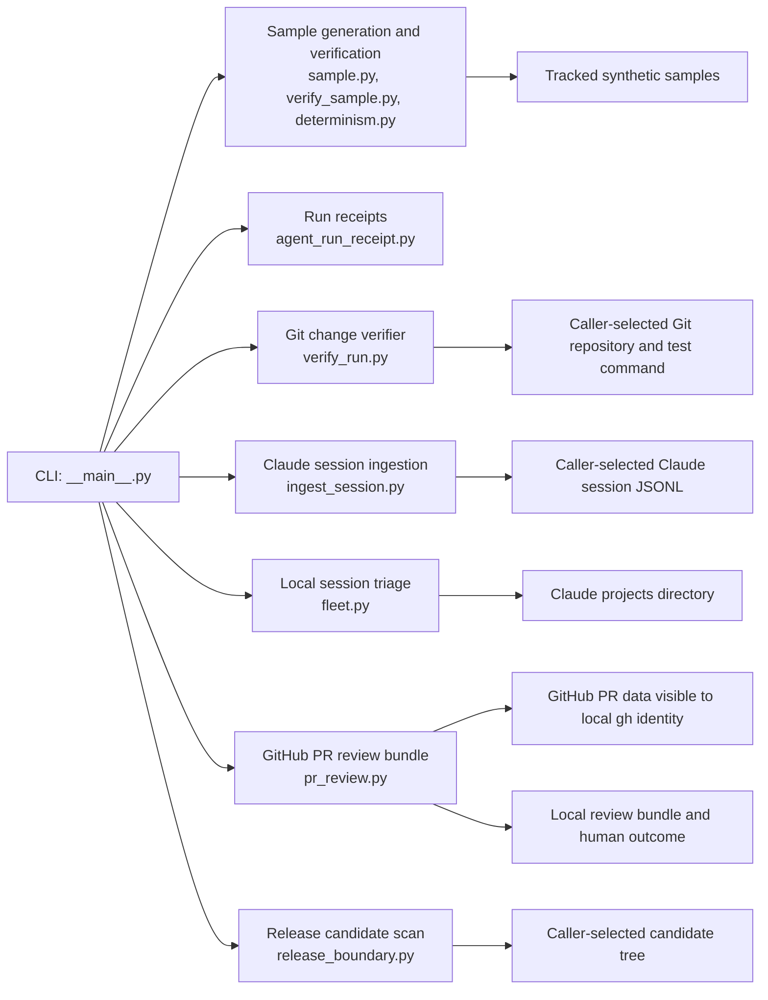

# Architecture and data boundaries

Agent Evidence Recorder is a Python package with separate commands for
synthetic fixtures, local repository verification, local session inspection,
and GitHub PR metadata. These paths do not share one trust or privacy
boundary.

## Component map



The CLI routes to focused modules. It does not provide a hosted coordinator or
an autonomous approval path.

| Path | Inputs and effects | What its result establishes |
| --- | --- | --- |
| Synthetic samples | Tracked fixtures; deterministic generation in a temporary directory for comparison. | The sample format and verifier behave as encoded by the fixtures and checks. It does not establish live-agent reliability. |
| Run receipts | JSON receipts and generated synthetic receipt examples. | Receipt fields and deterministic scoring rules produce the expected results for the tracked examples. |
| `verify-run` | Caller-selected Git base/head refs; may run the caller-supplied test command in a clean checkout. | Reports bounded Git and test observations. It does not prove that the change is correct, safe, or approved. |
| `ingest-session` and `fleet` | Local Claude Code session JSONL files or the Claude projects directory. | Produces a local summary from those files. Redaction omits selected fields only; other metadata such as working directory, branch, timestamps, model names, and PR links may remain. In addition, `fleet --json` currently emits the raw records even when `--redact` is set. Do not share JSON output. |
| `pr-review` | Uses the `gh` CLI and its current identity to fetch PR metadata and bounded diff excerpts; writes a local bundle. The repository may be public or private. | The bundle may contain private PR titles, bodies, file paths, status data, and diff snippets. It does not check out the repository or run CI, but it does not enforce a public-repository boundary. Treat output as private unless the source and bundle are reviewed and sanitized. It does not approve a PR or replace human review. |
| Release-boundary scan | A caller-selected tree, inspected for the rules in `release_boundary.py`. | Finds only issues covered by those deterministic checks; it is not a comprehensive security scanner. |

## Evidence flow

For the synthetic path, `sample.py` creates fixtures, `verify_sample.py`
checks their structure and expected statuses, and `determinism.py` regenerates
the samples in a temporary location and compares them with the tracked copies.
The tests include negative outcomes such as rejected, blocked, and
human-review-required runs.

For PR review, `pr_review.py` uses `gh` to fetch metadata visible to the
caller's current GitHub identity, normalizes it, records manifest hashes, and
writes a reviewer worksheet. The output may contain private PR data, including
patch excerpts. Bundle verification checks internal consistency but does not
scan or redact that data. The human outcome remains a separate input;
successful bundle verification is not approval. The contract is in
[`PR_REVIEW_CONTRACT_V0_2.md`](PR_REVIEW_CONTRACT_V0_2.md).

The Git verifier, session tools, and release-boundary scan operate on local
inputs supplied by the caller. They are not part of the synthetic fixture
path and their output must not be treated as public-safe without review.

## Development checks

From the repository root:

```bash
python3 -m unittest discover -s tests -p "test_*.py"
python3 -m agent_evidence_recorder verify-sample-determinism
python3 -m py_compile $(find . -name '*.py' -not -path './.*')
```

These match the current CI test and syntax checks plus the deterministic sample
check. CI exercises Python 3.10, 3.11, and 3.12. No test result grants merge,
deployment, release, or real-world action authority.

## Current next step

Keep the public sample and verifier contract accurate. Any future live-adapter
work remains on hold until the explicit conditions in the
[live adapter decision gate](LIVE_ADAPTER_BOUNDARY.md) are met and the user
approves that implementation. The current repo does not contain live provider
execution.
